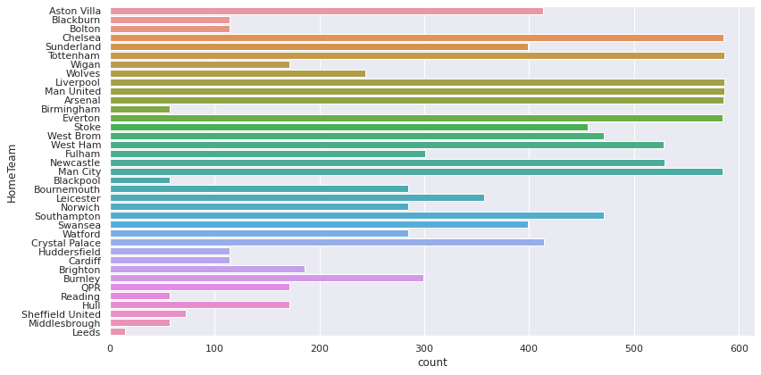
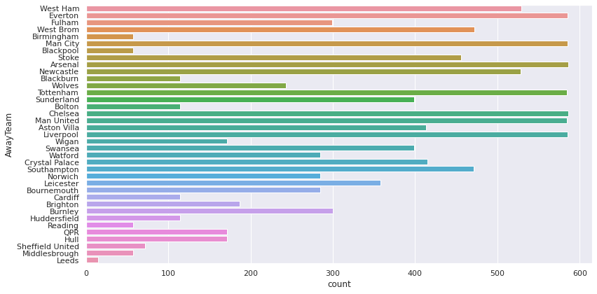
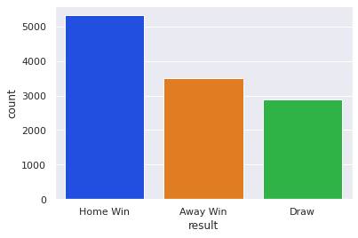
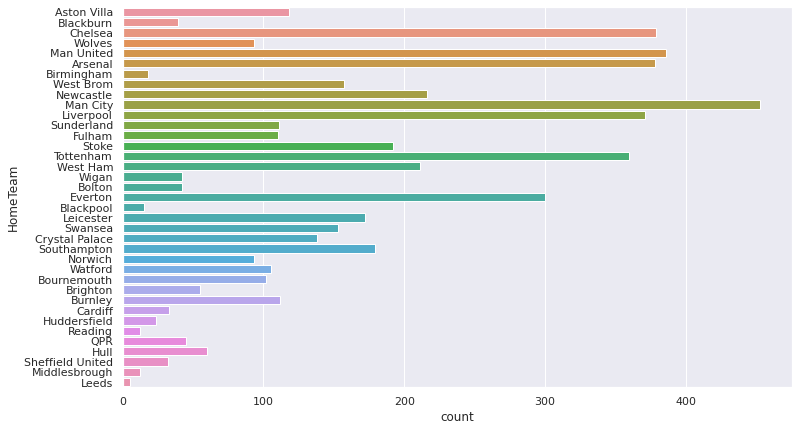
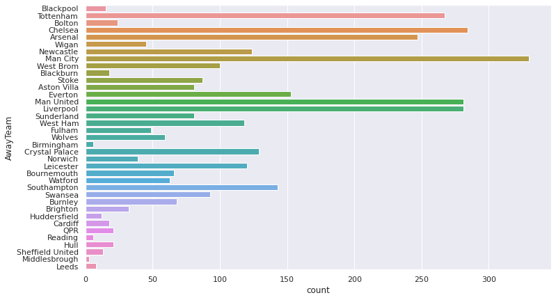
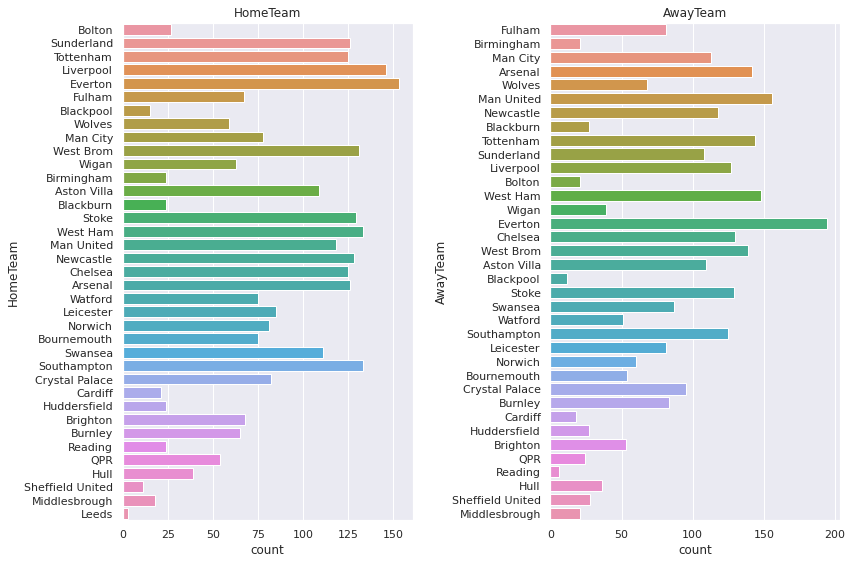
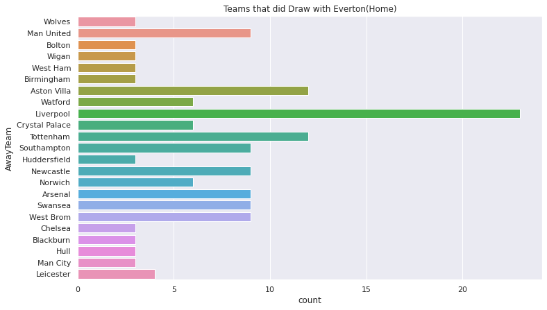
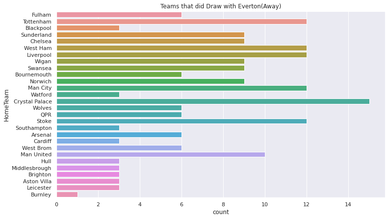
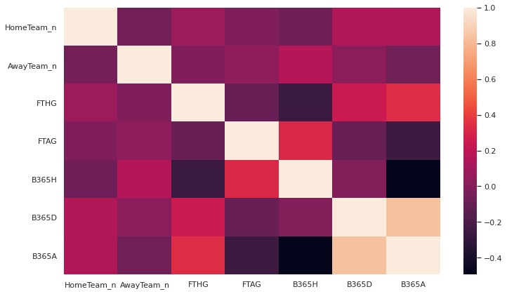
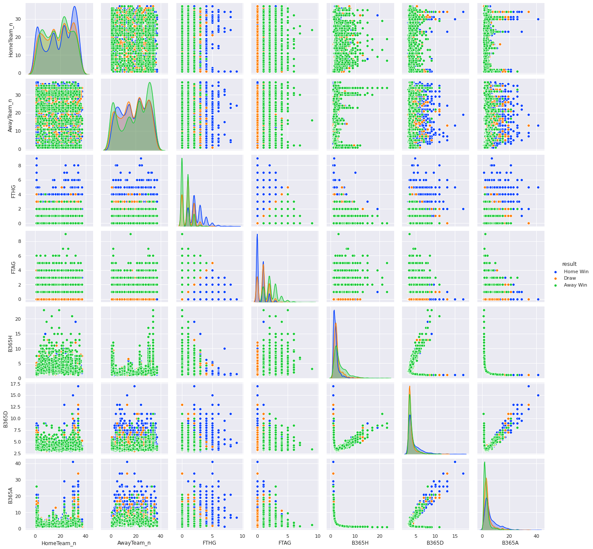

<h1 align="center">Plots</h1>

-----

```python
# A plot of how much the teams played from home
##
plt.figure(figsize=(12,6))
sns.countplot(y='HomeTeam', data=df)
plt.tight_layout()
```

<p align="center">
	
</p>


```python
# A plot of how much the teams played from away
##
plt.figure(figsize=(12,6))
sns.countplot(y='AwayTeam', data=df)
plt.tight_layout()
```

<p align="center">
	
</p>


```python
# distribution of results
##
sns.countplot('result', data=df, order=['Home Win', 'Away Win', 'Draw'])
```

<p align="center">
	
</p>


```python
# plot to show home wins for every team
##
plt.figure(figsize=(12,7))
sns.countplot(y='HomeTeam',data=df[df.result == 'Home Win'])
```

<p align="center">
	
</p>


```python
# plot to show Away wins for every team
##
plt.figure(figsize=(12,7))
sns.countplot(y='AwayTeam',data=df[df.result == 'Away Win'])
```

<p align="center">
	
</p>


```python
# plot to show draws
##
fig, ax = plt.subplots(1, 2, figsize=(12,8))
sns.countplot(y='HomeTeam', data=df[df.result == 'Draw'], ax=ax[0])
ax[0].set_title("HomeTeam")
sns.countplot(y='AwayTeam', data=df[df.result == 'Draw'], ax=ax[1])
ax[1].set_title("AwayTeam")

plt.tight_layout()
```

<p align="center">
	
</p>


```python
plt.figure(figsize=(12,7))
sns.countplot(y='AwayTeam', data=df[(df.HomeTeam == 'Everton') & (df.result == 'Draw')])
plt.title("Teams that did Draw with Everton(Home)")
```


<p align="center">
	
</p>


```python
plt.figure(figsize=(12,7))
sns.countplot(y='HomeTeam', data=df[(df.AwayTeam == 'Everton') & (df.result == 'Draw')])
plt.title("Teams that did Draw with Everton(Away)")
```


<p align="center">
	
</p>


```python
# heatmap
##
plt.figure(figsize=(12,7))
sns.heatmap(df.corr())
```


<p align="center">
	
</p>


```python
# pairplot
##
sns.pairplot(df, hue='result')
```


<p align="center">
	
</p>


